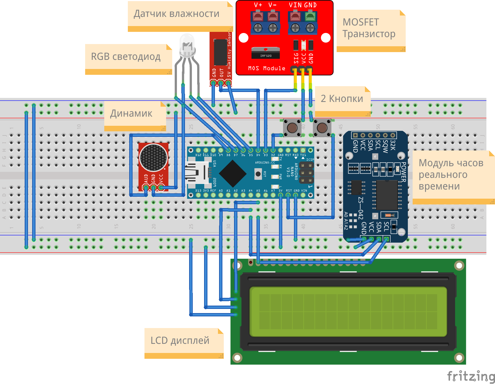

# mega-humidifier

Проект автоматического увлажнителя воздуха.

Сделан для курсов "Практикум по цифровому производству" и "Микроконтроллеры" в МФТИ ФРКТ 4 семестр.

## Цель проекта

Разработка автоматического увлажнителя для улучшения микроклимата в квартире

## Задачи проекта

1. Изучить теоретическую литературу по данному вопросу.
2. Изучить существующие аналоги.
3. Продумать и создать модель испарителя.
    + Разработать конструкцию данного устройства и необходимые элементы взаимодействия с окружающей средой.
    + Провести расчеты характеристик модели.
    + Подобрать нужные материалы.
    + Собрать модель.
4. Провести испытание полученного устройства.
5. Рассчитать производительность и КПД устройства с помощью данных полученных
экспериментально.
6. Улучшить устройство с учётом ошибок начальной версии.
7. Разработать технику безопасности и инструкцию по пользованию прибором.
8. Сравнить характеристики самодельного прибора с магазинным экземпляром.
9. Сделать выводы, продумать дальнейшее усовершенствование модели.

## Инструкция/Функционал:

1. Включить в сеть электропитания.
2. Проверить экран на наличие вывода данных и включения вентилятора и испарителя. 
3. На экран выводится: реальное время, примерное время окончания работы цикла
увлажнителя, показания влажности и температуры.
4. Запуск увлажнителя - фиксированное время. На паузу увлажнителем можно поставить нажатием кнопки, чтобы
продолжить работу нужно нажать её повторно. В это время будет выводится только реальное время и статус - “Пауза”.
5. Изменение скорости работы вентилятора и мощности испарения происходит за счет двух вращательных регуляторов.
6. По окончанию работы выводится сообщение об окончании и звучит оповещающий сигнал. Чтобы перезапустить увлажнитель и начать новую сессию, нужно нажать один раз на белую кнопку.

## Практическая часть

### Конструкционная (механическая) часть

Были изучены аналоги увлажнителей и выбран вариант сборки всех частей в
одной ёмкости. Ёмкость представляет из себя пластиковый контейнер, с высокими стенками и
ручками, вместимость - 4.5 литра размером 17.5x17x21 см

В крышке контейнера вмонтирован вентилятор (60x60x15 см) для вентиляции и создания
нагнетания воздуха. Таким образом поток воздуха насыщается водой, проходя через
увлажнитель, и испаряясь выходит из увлажнителя. Также вмонтирована направляющая конструкция(60x60x??? см), чтобы пар выходил под углом 45 градусов.

Электроника размещена в отдельной пластиковом корпусе. Все элементы закреплены вместе на ???

Корпус для электроники а также направляющая конструкция были смоделированы(исходники в ./stl), а затем распечатаны на 3D принтере.

### Электрическая (модульная) часть

Питание всех модулей осуществляется через блок питания AC/DC IN: 100-200V, OUT: 24V & 1A.

Испаритель воды получает 24В (номинальные) при этом регулируемые через ШИМ. Также подача питания на него регулируется MOSFET транзистором.

Остальные элементы имеют номинал 10В, поэтому используется понижающий преобразователь DC-DC.

На вентилятор подается 10В через ШИМ и MOSFET транзистор.

**Схема питания модулей:**

**[Схема](./schemes/scheme_arduino.fzz) (выполнена в Fritzing) подключения датчиков к Arduino Nano(лежит в `./schemes`):**

**Датчики и элементы:**

+ Arduino Nano
+ Вентилятор 10В
+ Испаритель 24В
+ Светодиодный модуль KY-016
+ Звуковой модуль KY-006
+ MOSFET транзистор IRF520N x2
+ ШИМ регулятор XK-1074 x2
+ Датчик влажности DHT11
+ Тактовая кнопка KY-004
+ DC-DC преобразователь MP1584
+ Модуль реального времени RTC DS1307
+ Дисплей LCD 1602 I2C
 
[Код](./scripts/main.ino) прошивки выполнен в программе Arduino IDE(исходный код в `./scripts`).

**Использовались библиотеки(лежит в `./libs`):** 
   - [для модуля часов реального времени RTC](https://github.com/adafruit/RTClib/releases/tag/1.14.2)
   - [для датчиков влажности](https://istarik.ru/blog/arduino/35.html)
   - [для дисплея с шиной I2C](https://iarduino.ru/file/134.html)
   - [для использования шины I2C(стандартная)](https://docs.arduino.cc/language-reference/en/functions/communication/wire/)

**Основные функции и задачи Arduino:**

1. Управление работой увлажнителя (а именно испарителя и вентилятора) с помощью MOSFET транзисторов.
2. Создание интерфейса для более удобного управления пользователем увлажнителя с
помощью вывода информации на дисплей и управления модулями с помощью кнопок и регуляторов.
3. Измерение и мониторинг показателей микроклимата в квартире (влажность и
температура).
4. Контроль работы с помощью индикации, а также сигнализировании пользователя о завершении работы с помощью звукового модуля.

**Описание кода:**

1. Использованные библиотеки: для датчика влажности (`stDHT.h`), для дисплея
(`LiquidCrystal_I2C.h`), для модуля часов реального времени (`RTClib.h`) и
стандартная библиотека (`Wire.h`).
2. Для большинства модулей написаны отдельные функции: для датчика влажности,
для MOSFET и пьезоэлемента, для модуля часов реального времени.
3. Процесс представляет из себя лимитированная по времени сессия работы. В коде
прописывается время продолжительности работы и автоматически после
определенного времени увлажнитель отключает нагреватель и выводит на экран
надпись `END OF SESSION. PRESS <RESET>`. Чтобы обновить сессию и
заново запустить процесс, нужно нажать на отдельную кнопку Reset.
4. В процессе работы увлажнителя на дисплей выводится реальное время и показания
влажности и температуры, а также время до конца сессии (работы увлажнителя).
Также есть индикация (светодиод), который светит красным цветом или зеленым в
зависимости от того оптимальная ли влажность или нет. Границы также
можно указать в коде.
5. Реализована функция "Паузы", т.е. можно нажатием кнопки Button приостановить
(и продолжить повторным нажатием) работу испарителя и вывод данных на
дисплей. Таким образом можно остановить работу увлажнителя простым нажатием
кнопки на неопределенное время. В процессе паузы выключены реле, светодиод
горит синим цветом и на дисплее выводится надпись `PAUSE` и время с кол-вом оставшегося времени.

<video src='./media/arduino.mp4'/>

## Экспериментальный расчет

???

## Результаты

???