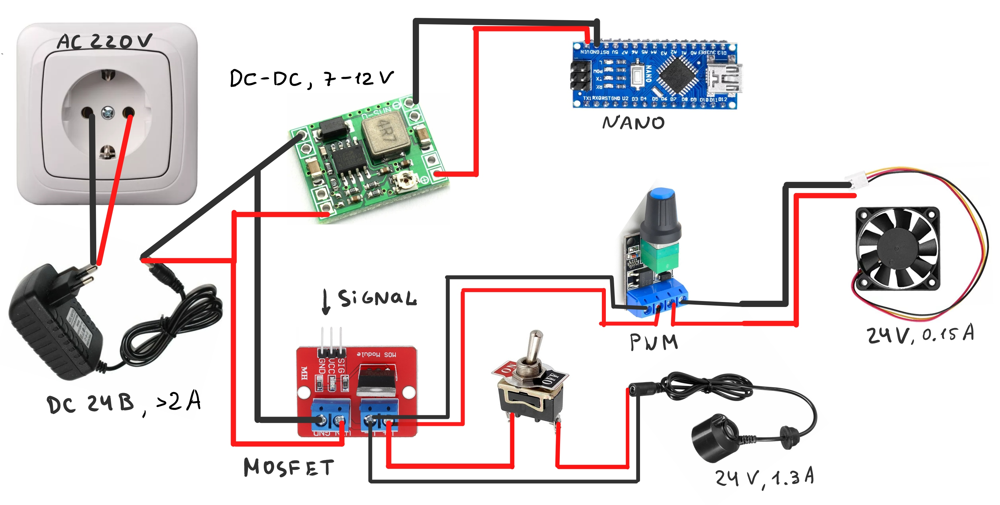

# mega-humidifier

Проект умного увлажнителя воздуха.

Сделан для курсов "Практикум по цифровому производству" и "Микроконтроллеры" в МФТИ ФРКТ 4 семестр.

**Команда:**
- Хмельницкий Антон Б01-306
- Шилов Артем Б01-306
- Багацкий Дмитрий Б01-301

## Цель проекта

Разработка автоматического увлажнителя для улучшения микроклимата в квартире

## Задачи проекта

1. Изучить теоретическую литературу по данному вопросу.
2. Изучить существующие аналоги.
3. Продумать и создать модель испарителя.
    + Разработать конструкцию данного устройства и необходимые элементы взаимодействия с окружающей средой.
    + Провести расчеты характеристик модели.
    + Подобрать нужные материалы.
    + Собрать модель.
4. Провести испытание полученного устройства.
5. Рассчитать производительность и КПД устройства с помощью данных полученных
экспериментально.
6. Улучшить устройство с учётом ошибок начальной версии.
7. Разработать технику безопасности и инструкцию по пользованию прибором.
8. Сравнить характеристики самодельного прибора с магазинным экземпляром.
9. Сделать выводы, продумать дальнейшее усовершенствование модели.

## Инструкция/Функционал:

1. Включить в сеть электропитания.
2. Проверить экран на наличие вывода данных и включения вентилятора и испарителя. 
3. На экран выводится: реальное время, примерное время окончания работы цикла
увлажнителя, показания влажности и температуры.
4. Запуск увлажнителя - фиксированное время. На паузу увлажнителем можно поставить нажатием кнопки, чтобы
продолжить работу нужно нажать её повторно. В это время будет выводится только реальное время и статус - “Пауза”.
5. Изменение скорости работы вентилятора и мощности испарения происходит за счет двух вращательных регуляторов.
6. По окончанию работы выводится сообщение об окончании и звучит оповещающий сигнал. Чтобы перезапустить увлажнитель и начать новую сессию, нужно нажать один раз на белую кнопку.

## Практическая часть

### Электрическая (модульная) часть

**Схема питания модулей:**

**[Схема](./schemes/scheme_arduino.fzz) (выполнена в Fritzing) подключения датчиков к Arduino Nano(лежит в `schemes/`):**

Питание всех модулей осуществляется через блок питания AC/DC IN: 100-200V, OUT: 24V & 1A.

Испаритель воды получает 24В (номинальные) при этом питание регулируется через тумблер. Также подача питания на него регулируется MOSFET транзистором. На вентилятор подается 24В через ШИМ и MOSFET транзистор.

Используется понижающий преобразователь DC-DC (в данном случае с 24В до 7-12В) для питания Arduino Nano .

**Датчики и элементы:**

+ Arduino Nano
+ Вентилятор 24В
+ Испаритель 24В
+ Светодиодный модуль KY-016
+ Звуковой модуль KY-006
+ MOSFET транзистор IRF520N
+ ШИМ регулятор XK-1074
+ Тумблер ON-OFF (2A+ 24V+) 
+ Датчик влажности DHT11
+ Тактовая кнопка KY-004 x2
+ DC-DC преобразователь MP1584
+ Модуль реального времени RTC DS3231
+ Дисплей LCD 2004 I2C
 
[Код](./scripts/main/main.ino) прошивки выполнен в программе Arduino IDE(исходный код в `scripts/main/`).

**Использовались библиотеки(лежит в `libs/`):** 
   - [для модуля часов реального времени RTC](https://github.com/adafruit/RTClib/releases/tag/1.14.2)
   - [для датчиков влажности](https://istarik.ru/blog/arduino/35.html)
   - [для дисплея с шиной I2C](https://iarduino.ru/file/134.html)
   - [для использования шины I2C(стандартная)](https://docs.arduino.cc/language-reference/en/functions/communication/wire/)

**Основные функции и задачи Arduino:**

1. Управление работой увлажнителя (а именно испарителя и вентилятора) с помощью MOSFET транзисторов.
2. Создание интерфейса для более удобного управления пользователем увлажнителя с
помощью вывода информации на дисплей и управления модулями с помощью кнопок и регуляторов.
1. Измерение и мониторинг показателей микроклимата в квартире (влажность и
температура).
1. Контроль работы с помощью индикации, а также сигнализировании пользователя о завершении работы с помощью звукового модуля.

**Описание кода:**

1. Использованные библиотеки: для датчика влажности (`stDHT.h`), для дисплея
(`LiquidCrystal_I2C.h`), для модуля часов реального времени (`RTClib.h`) и
стандартная библиотека (`Wire.h`).
2. Для большинства модулей написаны отдельные функции: для датчика влажности,
для MOSFET и пьезоэлемента, для модуля часов реального времени.
3. Процесс представляет из себя лимитированная по времени сессия работы. В коде
прописывается время продолжительности работы и автоматически после
определенного времени увлажнитель отключает нагреватель и выводит на экран
надпись `END OF SESSION. PRESS <RESET>`. Чтобы обновить сессию и
заново запустить процесс, нужно нажать на отдельную кнопку Reset.
4. В процессе работы увлажнителя на дисплей выводится реальное время и показания
влажности и температуры, а также время до конца сессии (работы увлажнителя).
Также есть индикация (светодиод), который светит красным цветом или зеленым в
зависимости от того оптимальная ли влажность или нет. Границы также
можно указать в коде.
5. Реализована функция "Паузы", т.е. можно нажатием кнопки Button приостановить
(и продолжить повторным нажатием) работу испарителя и вывод данных на
дисплей. Таким образом можно остановить работу увлажнителя простым нажатием
кнопки на неопределенное время. В процессе паузы выключены реле, светодиод
горит синим цветом и на дисплее выводится надпись `PAUSE` и время с количеством оставшегося времени.

Параметры для настройки работы увлажнителя находятся в [setup.inc](./scripts/main/setup.inc), можно настроить:
- Время работы увлажнителя.
- Минимальную/максимальную допустимую влажность.
- Длительность и тон писка.

**Демонстрация электроники:**

https://github.com/user-attachments/assets/03b7d397-51f3-43c1-a0f4-bfc7255fe9b3

### Конструкционная (механическая) часть

**Контейнер:**

Были изучены аналоги увлажнителей и выбран вариант сборки всех частей в
одной ёмкости. Ёмкость представляет из себя пластиковый контейнер, с высокими стенками и
ручками, вместимость - 4.5 литра размером 17.5x17x21 см

В крышке контейнера вмонтирован вентилятор (60x60x15 см) для вентиляции и создания
нагнетания воздуха. Таким образом поток воздуха насыщается водой, проходя через
увлажнитель, и испаряясь выходит из увлажнителя. Также вмонтирована направляющая конструкция(60x60x15 см), чтобы пар выходил под углом 45 градусов.

**Крышка и корпус:**

Электроника размещена в отдельной пластиковом корпусе с вырезом для дисплея и выведенными на бок датчиками и кнопками. 
Кнопки размещены на корпусе и прикреплены винтами М2.5.

Корпус для электроники, а также направляющая конструкция были смоделированы в SolidWorks/Компас3D (исходники в `enclosure/SLDPRT/` и `enclosure/STL/`), а затем распечатаны на 3D принтере. Отверстия вырезались с помощью дремеля или были смоделированы при проектировании корпуса перед печатью.

**Печатная плата:**

Была смоделирована (исходники в `plate/`) печатная плата для сборки всех датчиков с помощью KiCad и FlatCam и вырезана на фрезерном станке Charly4U:

- Все датчики монтируются непосредственно либо на плате(односторонняя, но крепятся датчики с двух сторон), либо отдельно проводами.
- Сделаны 3 отверстия для монтажа платы к корпусу винтами M3.

## Процесс

## Экспериментальный расчет

Производительность парогенератора: 450 мл/ч

Емкость рассчитана на 4.5л, с учетом датчика уровня воды встроенного в парогенератор, эффективный объем воды для испарения 2.5л.

Получаем примерную длительность работы увлажнителя - 5.5ч. 

Рекомендованная настройка работы увлажнителя - 5ч.

## Сравнение с аналогами

Примерная цена всех компонентов: 3500 руб, что меньше чем цена за аналоги с меньшим функционалом.

- [AlexGyver Humidifier](https://github.com/AlexGyver/autoHumidifier) - рядом не стояло.
- [Ivan9073 Youtuber](https://www.youtube.com/watch?v=dj69xXlSA7M) - в подметки не годится.
- [Dzen RMNT.RU](https://dzen.ru/a/ZfLKBk9sOwf64ch5) - слабо.
- [Алексей Федосенко Youtuber](https://www.youtube.com/watch?v=r24A2fugexM) - детский сад.
- [VITEK VT-2348](https://ozon.ru/t/ggRDX7P) - больший функционал, дешевле.

https://github.com/user-attachments/assets/1c645f1c-7396-49a5-b0d6-75ca31a28341
 
## Результаты и выводы

В ходе разработки автоматического увлажнителя воздуха были выполнены все основные этапы проектирования и сборки устройства.

1. Функциональность устройства

Увлажнитель успешно выполняет свою основную функцию – насыщает воздух влагой с регулируемыми параметрами интенсивности испарения и вентиляции.
Система управления через Arduino Nano позволяет контролировать показатели микроклимата (температуру и влажность), а также задавать параметры работы устройства.
Реализован удобный пользовательский интерфейс с дисплеем, кнопками и регуляторами.
Встроены индикация и звуковой сигнал, что повышает удобство эксплуатации.

2. Эффективность увлажнения

Производительность парогенератора составила 450 мл/ч, что позволяет устройству работать в течение 5,5 часов на одном полном резервуаре (эффективный объем 2,5 л). Также есть возможность расширения объема использовав емкость с большим объемом.
Экспериментальные замеры показали, что устройство способно поддерживать уровень влажности в помещении на оптимальном уровне (40-60%) в зависимости от настроек.

3. Сравнение с аналогами

В сравнении с коммерческими моделями устройство показало схожие характеристики по производительности, но с возможностью гибкой настройки режимов работы.
Стоимость самодельного увлажнителя оказалась ниже аналогичных готовых устройств, что делает проект экономически оправданным.

4. Конструкционные и инженерные решения

Использование 3D-печати позволило создать компактный корпус и направляющую конструкцию для выхода пара.
Электронные компоненты были успешно интегрированы на печатную плату, что упростило сборку и повысило надежность системы.
Устройство собрано из доступных компонентов, что делает возможным его дальнейшее усовершенствование.

5. Недостатки и возможные улучшения

В будущем можно реализовать автоматическое отключение при достижении заданного уровня влажности.
Возможно добавление управления через Wi-Fi/мобильное приложение для удаленного контроля и мониторинга.
Можно усовершенствовать систему подачи воды, чтобы увеличить время автономной работы.

## Вывод

Созданный умный увлажнитель воздуха соответствует поставленным требованиям и демонстрирует высокую эффективность в поддержании комфортного уровня влажности в помещении. Проект успешно прошел этап испытаний, подтвердил свою работоспособность и может быть доработан в будущем для повышения удобства использования и расширения функционала.

